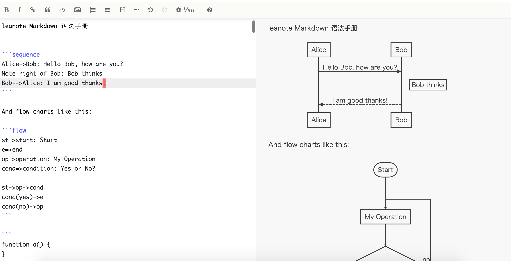

# Markdown Editor For Leanote Web & Desktop App

Leanote's Markdown Editor originally forked from [Stackedit](https://github.com/benweet/stackedit)-[v3.1.14](https://github.com/benweet/stackedit/releases/tag/v3.1.14). The Stackedit source is under Apache License (http://www.apache.org/licenses/LICENSE-2.0) and the code updated by Leanote is under GPL v2.

## Difference with [Leanote-Markdown-Editor](https://github.com/leanote/markdown-editor)

* Use Ace Editor as main editor
* Support Vim & Emacs mode

## Branches

* [master](https://github.com/leanote/desktop-app-v2) Markdown Editor v2 For [Leanote](https://github.com/leanote/leanote)
* [desktop-app](https://github.com/leanote/markdown-editor-v2/tree/desktop-app) Markdown Editor v2 For [Leanote Desktop App](https://github.com/leanote/desktop-app)

## Build

Please install `node` and `gulp` firstly.

```
> gulp # build & minify res-min/main-v2.js (https://github.com/leanote/leanote/blob/master/public/dist/main-v2.js), res-min/main-v2.min.js (https://github.com/leanote/leanote/blob/master/public/dist/main-v2.min.js)
```

## Local Debug

```
> node server.js
```

See: http://localhost:3001/editor.html



## Integrated With Leanote

Copy `res-min/main-v2.min.js` to leanote's path `/public/dist/`.

Update node-dev.html with:

```html
<script>
initPage();
window.require = {
    baseUrl: '/public',
};
</script>

<!-- pro_markdown_js -->

<!-- dev -->
<script src="/js/require.js"></script>
<script src="/public/dist/main-v2.min.js"></script>
<!-- /dev -->

<script src="/public/js/plugins/main.js"></script>
</body>
```

## Source Debug With Leanote 

Replace node-dev.html with:

```html
<script>
initPage();
window.require = {
    baseUrl: '/public/res', // link to res
};
</script>

<!-- pro_markdown_js -->

<!-- dev -->
<script src="/js/require.js"></script>
<script src="/public/res/main.js"></script>
<!-- /dev -->

<!--
<script src="/public/js/plugins/main.js"></script>
-->
</body>
```

----------------------------------------

## 与 [Leanote-Markdown-Editor](https://github.com/leanote/markdown-editor) 的不同

* 使用Ace编辑器作为主要的编辑器
* 支持Vim和Emacs编辑模式

## 构建

确保在此之前安装了node, gulp
```
> gulp # 生成 res-min/main-v2.js (https://github.com/leanote/leanote/blob/master/public/dist/main-v2.js) 和 res-min/main-v2.min.js (https://github.com/leanote/leanote/blob/master/public/dist/main-v2.min.js)
```

## 本地调试

```
> node server.js
```

访问: http://localhost:3001/editor.html


## Leanote 使用本 Markdown v2 编辑器

将 `res-min/main-v2.min.js` 复制到leanote的 `/public/dist/` 下

node-dev.html:

```html
<script>
initPage();
// 当tinymce.dev.js时, 请注释require
window.require = {
    baseUrl: '/public',
};
</script>

<!-- pro_markdown_js -->

<!-- dev -->
<script src="/js/require.js"></script>
<script src="/public/dist/main-v2.min.js"></script>
<!-- /dev -->

<script src="/public/js/plugins/main.js"></script>
</body>
```

## Leanote 调试 Markdown 编辑器的源码

替换node-dev.html

```html
<script>
initPage();
window.require = {
    baseUrl: '/public/res', // res指向源码
};
</script>

<!-- pro_markdown_js -->

<!-- dev -->
<script src="/js/require.js"></script>
<script src="/public/res/main.js"></script>
<!-- /dev -->

<!--
不要
<script src="/public/js/plugins/main.js"></script>
-->
</body>
```